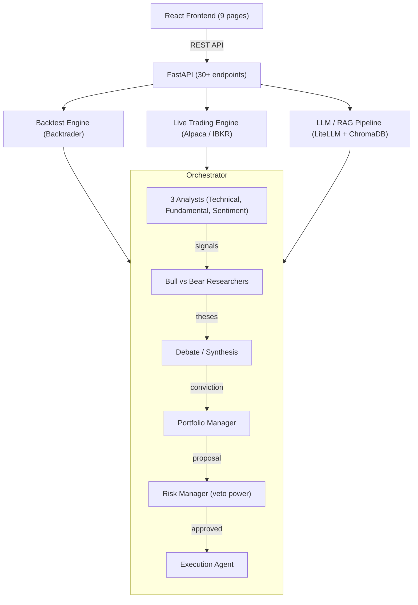
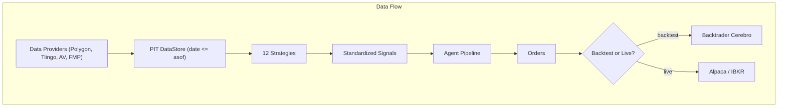

<p align="center">
  <h1 align="center">AI Multi-Agent Stock Investment Firm</h1>
  <p align="center">
    A production-grade, multi-agent AI system that operates like a professional investment firm.<br/>
    12 quant strategies &bull; 8 AI-augmented agents &bull; Live & paper trading &bull; RAG-powered research
  </p>
</p>

<p align="center">
  
  
  
  <a href="https://github.com/avim2809/ai-trading-system/actions/workflows/ci.yml"></a>
  
</p>

---

## Overview

This system simulates (and can execute) the full workflow of a quantitative investment firm:

1. **Signal Generation** &mdash; 12 pluggable alpha strategies analyze market data
2. **Research Debate** &mdash; Bull and bear AI researchers build competing investment theses
3. **Portfolio Construction** &mdash; A portfolio manager synthesizes research into target weights
4. **Risk Management** &mdash; A risk manager enforces constraints with veto power
5. **Execution** &mdash; Orders route to Backtrader (backtest) or live brokers (Alpaca / IBKR)

Every step can run in pure quant mode, AI-enhanced mode (quant + LLM reasoning), or AI-only mode &mdash; configurable per agent.

## Key Features

| Category | Details |
|----------|---------|
| **Strategies** | Cross-sectional momentum, trend following, mean reversion, statistical arbitrage, multi-factor, sentiment, PEAD event-driven, ML prediction, volatility breakout, seasonality, W.D. Gann composite, HMM regime detection |
| **Agent Pipeline** | 3 domain analysts, bull/bear researchers, debate synthesis, portfolio manager, risk manager (6-constraint pipeline + veto), execution agent |
| **Backtesting** | Backtrader engine, strict no-look-ahead PIT data store, configurable rebalancing, broker-level transaction costs + slippage, per-strategy attribution, benchmark-relative metrics (alpha/beta/info ratio), walk-forward validation |
| **Live Trading** | Alpaca (paper + live), Interactive Brokers (paper + live), configurable approval workflow (full-auto / semi-auto per strategy), APScheduler, drawdown kill-switch + operational alerts |
| **AI / LLM** | LiteLLM (Groq, Ollama, OpenAI, Anthropic, any OpenAI-compatible), free model by default, per-agent mode switching, SQLite response cache, token compression |
| **RAG Pipeline** | ChromaDB vector store, 8 embedding models (MiniLM, Nomic, Qwen2, BGE, E5), SEC EDGAR / earnings / news / research paper ingestors |
| **Frontend** | React + TypeScript + Tailwind dark theme, 9 pages: Dashboard, New Backtest, Run Detail, Compare, Agent Inspector, Live Dashboard, Config, Approvals, Order History |
| **Data Providers** | Polygon, Tiingo, Alpha Vantage, FMP + synthetic data for zero-config backtesting |
| **Testing & CI** | 425 tests (unit, integration, E2E, no-look-ahead, reproducibility golden-run); GitHub Actions CI runs ruff + pytest + frontend build |

## Architecture





### No Look-Ahead Guarantee

All data flows through `PointInTimeDataStore`, which physically filters every query to `date <= asof`. Strategies receive a read-only `PitView` bound to a single decision timestamp and cannot access future data. This is verified by dedicated tests that monkey-patch the data store.

## Quick Install

**Requirements:** Python >= 3.14 &bull; Node.js >= 18 (optional, for web UI) &bull; Ubuntu 26 / Debian or macOS

### One-Command Setup

**Ubuntu 26 / Linux** (installs system packages, Python 3.14, Java 17, Node.js, and optionally IB Gateway automatically):
```bash
chmod +x setup.sh
./setup.sh                               # core + API
./setup.sh --components all              # everything: API, live trading, LLM/RAG + IB Gateway
./setup.sh --components live             # live stack + IB Gateway
./setup.sh --components live --skip-ibkr # live stack without IB Gateway
```

> `--skip-system` skips `apt-get` (useful if you manage system deps yourself).
> `IBKR_INSTALL_DIR=/custom/path ./setup.sh --components live` overrides the IB Gateway install path (default `/opt/ibgateway`).

**Windows (PowerShell):**
```powershell
.\setup.ps1                        # core + web UI
.\setup.ps1 -Components all       # everything: API, live trading, LLM/RAG
.\setup.ps1 -Components api,live  # pick specific extras
```

### Manual Setup

```bash
python3.14 -m venv .venv && source .venv/bin/activate  # or .\.venv\Scripts\Activate.ps1
pip install -e ".[dev,api,live,llm]"
cp .env.example .env               # edit with your API keys
cd frontend && npm install && npm run build && cd ..
```

### Available Extras

| Extra | What it adds | Required for |
|-------|-------------|--------------|
| `api` | FastAPI server + REST API | Web UI |
| `live` | Alpaca + IBKR broker adapters, APScheduler | Live/paper trading |
| `llm` | LiteLLM, ChromaDB, sentence-transformers | AI-enhanced agents, RAG |
| `dev` | pytest, ruff, httpx | Development & testing |

### IB Gateway

When `--components live` (or `all`) is passed to `setup.sh`, IB Gateway is downloaded and installed automatically (requires Java 17, installed by the script on Ubuntu).

```bash
# Start gateway manually after setup:
./scripts/start_ibgateway.sh paper   # paper trading (port 4002)
./scripts/start_ibgateway.sh live    # live trading  (port 4001)
```

For **headless / auto-login** (no GUI dialog on each start), install [IBC (IB Controller)](https://github.com/IbcAlpha/IBC/releases) alongside the gateway. IBC handles credentials via a config file and is the recommended approach for server deployments.

## Usage

### Run a Backtest (CLI)

```bash
# Fetch market data
python scripts/fetch_data.py --symbols AAPL,MSFT,NVDA --start 2020-01-01 --end 2023-12-31

# Run backtest
python scripts/run_backtest.py --config config/settings.yaml
```

### Web Interface

```bash
firm-api                           # start server on http://localhost:8000
```

The web UI provides:

| Page | Route | Description |
|------|-------|-------------|
| **Dashboard** | `/` | View all backtest runs, compare metrics side-by-side |
| **New Backtest** | `/new` | Configure strategies, universe, dates, capital; launch a single run or a walk-forward analysis (synthetic or real data) |
| **Run Detail** | `/runs/:id` | Equity curve, drawdown chart, monthly returns heatmap, per-strategy attribution, benchmark-relative metrics |
| **Agent Inspector** | `/inspector` | Step through the full agent pipeline; see signals, theses, debate, risk decisions |
| **Live Dashboard** | `/live` | Start/stop live engine, view positions, account, recent cycles |
| **Configuration** | `/live/config` | Broker, schedule, per-strategy approval mode, AI model config, RAG management |
| **Approvals** | `/live/approvals` | Review and approve/reject pending trade proposals (semi-auto mode) |
| **Order History** | `/live/orders` | View all executed orders with fill details and strategy attribution |

### Live Trading

```bash
pip install -e ".[live]"
```

See [docs/PROJECT_CONTEXT.md](docs/PROJECT_CONTEXT.md) for architecture and production ops on bare-metal/systemd.

1. Add broker credentials to `.env` (Alpaca or IBKR)
2. Start `firm-api`
3. Navigate to `/live` and click **Start Engine**
4. Select broker (Alpaca Paper, Alpaca Live, IBKR Paper, IBKR Live)
5. Configure approval mode per strategy (Auto / Manual)

The engine emits operational alerts (`GET /api/live/alerts`): a drawdown kill-switch
(`kill_switch_drawdown` in `config/live.yaml`) halts new orders once peak-to-trough
drawdown is breached, plus broker-outage and degraded-reconciliation alerts. An
optional `alert_callback` can forward these to Slack/email/Sentry.

### AI-Enhanced Agents

```bash
pip install -e ".[llm]"
```

1. The default model is free (`groq/llama-3.3-70b-versatile`, needs a free `GROQ_API_KEY`; or run Ollama locally for fully offline). Add the relevant key to `.env`, or switch to a paid model (OpenAI/Anthropic) in `config/llm.yaml`.
2. Navigate to `/live/config` > **AI / LLM Configuration**
3. Select provider and model
4. Set per-agent mode: **Quant** (default), **AI-Enhanced**, or **AI-Only**
5. Ingest documents for RAG (SEC filings, earnings, news, research papers)

## Strategies

| # | Strategy | Type | Description |
|---|----------|------|-------------|
| 1 | `momentum` | Technical | Cross-sectional 12-1 month momentum; long winners, short losers |
| 2 | `trend` | Technical | Dual MA crossover (50/200d) scaled by inverse volatility |
| 3 | `mean_reversion` | Technical | 1-5 day short-term reversal via cross-sectional z-scores |
| 4 | `stat_arb` | Technical | Cointegrated pairs trading with OLS hedge ratios |
| 5 | `multi_factor` | Fundamental | Value + quality + momentum + low-vol composite |
| 6 | `sentiment` | Sentiment | News sentiment level + delta scoring |
| 7 | `event_driven` | Sentiment | Post-earnings announcement drift (PEAD) |
| 8 | `ml_prediction` | ML | Walk-forward GBR/Ridge with strict PIT training cutoff |
| 9 | `volatility_breakout` | Technical | ATR breakout from low-vol compression |
| 10 | `seasonality` | Technical | Turn-of-month + day-of-week calendar effects |
| 11 | `gann` | Technical | W.D. Gann composite: angles, Square of Nine, time cycles, swing, retracement |
| 12 | `regime_hmm` | Technical | Per-symbol Gaussian HMM regime detection (Bull/Chop/Bear) with directional, confidence-weighted signals |

### HMM Market-Regime Detection

`regime_hmm` treats markets as non-stationary processes that cycle between hidden
regimes. A per-symbol Gaussian Hidden Markov Model is fit (Baum-Welch) on
stationarised features — daily log return, 5-day cumulative log return, 14-period
ATR, and a 20-day volume-spike ratio — using only data up to `asof` (walk-forward,
no look-ahead). The forward posterior decodes the current regime; states are
labelled Bull / Chop / Bear by mean return, and the transition matrix is
Laplace-smoothed to avoid zero-probability collapse. Signals are long in Bull,
short in Bear, and damped in Chop, weighted by the regime posterior confidence.

A complementary **market-regime exposure overlay** in the `RiskAgent`
(`risk.regime_overlay.enabled: true`) detects the broad-market regime from a proxy
series and scales gross exposure per the playbooks — lever up in Bull, de-risk in
Bear/Chop — blended by posterior confidence so partial regime updates feed through
to sizing gradually (mitigating regime lag). The HMM logic lives in
[`firm/regime/`](src/firm/regime/) and is shared by both the strategy and the overlay.

> Validated by the literature: a 3-state Gaussian HMM outperforms double moving
> average strategies in total return and drawdown control (Chen, Yi & Zhao, 2020),
> and HMM-enhanced agents improve Sharpe/Sortino over non-regime-aware baselines
> (Ndoutoumou, Yin & Cheng, IDS 2025).

## Agent Pipeline

Each agent can operate in three modes:

| Mode | Description | LLM Cost |
|------|-------------|----------|
| **Quant** | Pure mathematical/rule-based (default) | Free |
| **AI-Enhanced** | Quant output + LLM reasoning + RAG context | Per call |
| **AI-Only** | LLM replaces quant logic entirely | Per call |

| Agent | Role | Quant Logic | LLM Enhancement |
|-------|------|-------------|-----------------|
| Technical Analyst | Aggregate technical signals | Z-score normalization | Validate patterns against research |
| Fundamental Analyst | Aggregate fundamental signals | Factor scoring | Analyze SEC filings context |
| Sentiment Analyst | Aggregate sentiment signals | Sentiment delta | Interpret news with nuance |
| Bull Researcher | Build long thesis | Confidence-weighted positive signals | Write evidence-backed thesis |
| Bear Researcher | Build short/risk thesis | Confidence-weighted negative signals | Cite specific risk factors |
| Debate | Synthesize bull vs bear | Net conviction arithmetic | Weigh arguments, adjust conviction |
| Portfolio Manager | Allocate capital | Conviction/equal/risk-parity weighting | Review allocation, flag risks |
| Risk Manager | Enforce constraints | 6-constraint pipeline + veto | Identify non-quantitative risks |

## RAG Knowledge Base

The RAG pipeline indexes documents into ChromaDB for retrieval during LLM-enhanced agent reasoning:

| Source | Collection | Description |
|--------|-----------|-------------|
| SEC EDGAR | `sec_filings` | 10-K, 10-Q, 8-K filings (free API) |
| FMP | `earnings` | Earnings call transcripts |
| RSS + Providers | `news` | Financial news from Yahoo, Reuters, Tiingo |
| arXiv | `research` | Quantitative finance research papers |
| System | `system_docs` | Strategy docstrings + config documentation |

**Embedding models** (configurable, all free/local):

| Model | Dimensions | Quality | Size |
|-------|-----------|---------|------|
| `all-MiniLM-L6-v2` (default) | 384 | Good | 80 MB |
| `nomic-ai/nomic-embed-text-v1.5` | 768 | Excellent | 550 MB |
| `Alibaba-NLP/gte-Qwen2-1.5B-instruct` | 1536 | Excellent | 3 GB |
| `BAAI/bge-large-en-v1.5` | 1024 | Excellent | 1.3 GB |
| + 4 more options | | | |

```bash
# Ingest documents
python scripts/ingest_docs.py --all --symbols AAPL,MSFT,GOOG
python scripts/ingest_docs.py --sec --symbols AAPL --years 2023,2024
python scripts/ingest_docs.py --system   # index system's own docs
```

## API Reference

All endpoints are under `/api`:

### Meta
| Method | Endpoint | Description |
|--------|----------|-------------|
| GET | `/api/health` | Health check |
| GET | `/api/strategies` | List strategies with descriptions |
| GET | `/api/config/defaults` | Default configuration |

### Backtesting
| Method | Endpoint | Description |
|--------|----------|-------------|
| GET | `/api/runs` | List all backtest runs |
| GET | `/api/runs/{id}` | Run details + config |
| GET | `/api/runs/{id}/report` | Performance report (metrics + attribution) |
| GET | `/api/runs/{id}/equity` | Equity curve + drawdown arrays |
| POST | `/api/runs` | Launch a new backtest |
| POST | `/api/runs/walk_forward` | Run a walk-forward analysis (folds + aggregated OOS metrics) |
| POST | `/api/runs/compare` | Compare multiple runs |
| POST | `/api/agents/step` | Run one pipeline step (Agent Inspector) |

### Live Trading
| Method | Endpoint | Description |
|--------|----------|-------------|
| GET | `/api/live/status` | Engine state, broker connection, next run |
| POST | `/api/live/start` | Start the live engine |
| POST | `/api/live/stop` | Stop gracefully |
| POST | `/api/live/trigger` | Manual cycle trigger |
| GET | `/api/live/positions` | Current broker positions |
| GET | `/api/live/account` | Account summary |
| GET | `/api/live/orders` | Order history |
| GET | `/api/live/cycles` | Recent cycle results |
| GET | `/api/live/alerts` | Operational alerts + kill-switch state |
| GET | `/api/live/approvals` | Pending approvals |
| POST | `/api/live/approvals/{id}/approve` | Approve trade |
| POST | `/api/live/approvals/{id}/reject` | Reject trade |
| GET | `/api/live/config` | Live config |
| PUT | `/api/live/config` | Update live config |

### LLM / RAG
| Method | Endpoint | Description |
|--------|----------|-------------|
| GET | `/api/llm/providers` | Available LLM providers |
| GET | `/api/llm/config` | LLM + agent mode config |
| PUT | `/api/llm/config` | Update LLM config |
| GET | `/api/llm/cache/stats` | Cache hit rate + cost savings |
| DELETE | `/api/llm/cache` | Clear response cache |
| GET | `/api/llm/rag/stats` | Document collection stats |
| POST | `/api/llm/rag/ingest` | Trigger document ingestion |
| GET | `/api/llm/embedding-models` | Available embedding models |
| PUT | `/api/llm/rag/embedding-model` | Change embedding model |
| POST | `/api/llm/test` | Test LLM connection |

## Project Structure

```
ai-trading-system/
├── src/firm/
│   ├── strategies/          # 12 alpha strategies + registry
│   ├── agents/              # 8 quant agents + orchestrator
│   │   └── llm/             # 8 LLM-enhanced agent variants
│   ├── backtest/            # Backtrader engine bridge
│   ├── brokers/             # Broker ABC + Alpaca + IBKR
│   ├── live/                # Live trading engine + scheduler + approvals
│   ├── llm/                 # LLM provider (LiteLLM) + cache + compression
│   ├── rag/                 # ChromaDB store + chunker + retriever + ingestors
│   ├── data/                # PIT store + 4 provider adapters + synthetic data
│   ├── api/                 # FastAPI app + routers (meta, runs, agents, live, llm)
│   ├── contracts/           # Frozen dataclass contracts (Signal, Thesis, etc.)
│   ├── portfolio/           # Portfolio state + attribution
│   ├── eval/                # Metrics, reports, plots
│   └── experiments/         # Experiment runner + versioned registry
├── frontend/                # React + TypeScript + Tailwind (9 pages)
├── config/                  # YAML configs (settings, live, llm, experiments)
├── scripts/                 # CLI tools (fetch_data, run_backtest, ingest_docs)
├── tests/                   # 425 tests (unit + integration + E2E)
├── .github/workflows/       # CI: ruff + pytest + frontend build
├── setup.ps1 / setup.sh     # One-command setup scripts
└── pyproject.toml            # Package config with 4 optional extras
```

## Configuration

| File | Purpose |
|------|---------|
| `.env` | API keys and secrets (from `.env.example`) |
| `config/settings.yaml` | Universe, backtest params, risk limits, data providers |
| `config/live.yaml` | Live trading: broker, schedule, approval mode, strategies |
| `config/llm.yaml` | LLM provider, agent modes, RAG settings, cache config |
| `config/experiments/*.yaml` | Parameterized experiment definitions |

## Testing

```bash
pytest                    # run all 425 tests
pytest tests/test_strategies.py  # strategy tests only
pytest tests/test_e2e.py  # end-to-end integration
pytest -k "no_look_ahead" # verify PIT safety
ruff check src tests      # lint (also enforced in CI)
```

CI (`.github/workflows/ci.yml`) runs ruff, the full pytest suite, and the frontend build on every push and PR to `main`.

## Engineering Standards

- **No look-ahead** &mdash; PIT data store with dedicated verification tests
- **Typed contracts** &mdash; Frozen dataclasses for all inter-agent messages
- **Deterministic runs** &mdash; Seeded randomness, versioned experiment configs
- **Structured logging** &mdash; JSON logs for every signal, decision, trade, and risk action
- **Graceful degradation** &mdash; All optional dependencies (LLM, brokers, RAG) use try/except imports
- **425 tests + CI** &mdash; Unit, integration, E2E, reproducibility, and no-look-ahead verification, gated by GitHub Actions (ruff + pytest + frontend build)

## License

MIT
